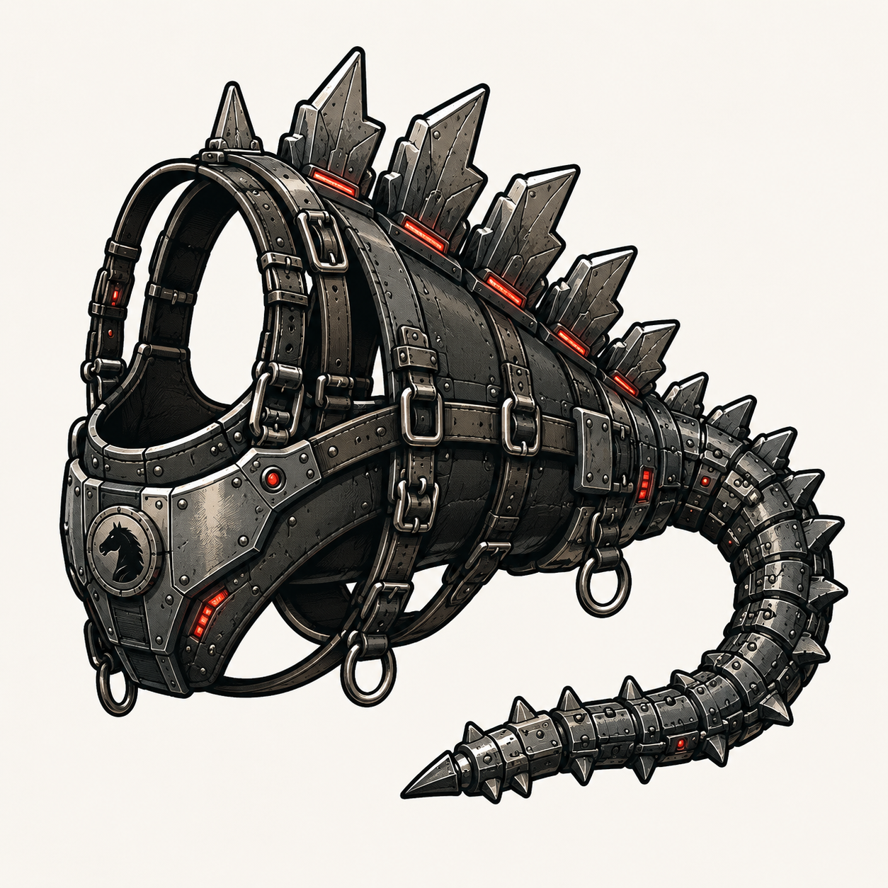

# MechaHarness docs

Python agentic harness that separates **how you call models** from **how you run agent loops**.

## Contents

| Page | Description |
|------|-------------|
| [Architecture](./architecture.md) | Inference Strategy + harness hierarchy |
| [Install & quick start](./guides/install.md) | Environment setup and first run |
| [CLI reference](./reference/cli.md) | `mechaharness` commands |
| [HTTP API reference](./reference/api.md) | FastAPI routes |

## Mental model

1. **Inference Strategy** — pluggable backends (`openai`, `anthropic`, `lmstudio`, `vllm`, `ollama`, …)
2. **Harness family** — agent-loop policy (`tool_loop`, `react`, `openai_tools`, `anthropic_tools`)
3. **Frontends** — Typer CLI and FastAPI share the same factory wiring

Normalized types in `mechaharness.core.types` are the portable contract for future language bindings.
